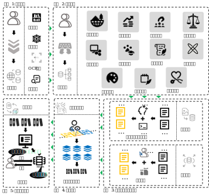
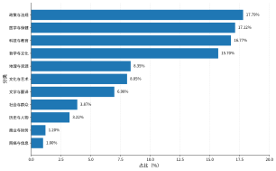
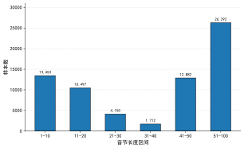

# TibSynth-Bench: A Linguistic-Structure-Constrained Dataset for Low-Resource Tibetan Text Correction and Real-Error Evaluation
# TibSynth-Bench：面向低资源藏文文本纠错的语言结构约束数据集构建
## 数据分布

<table>
  <tr>
    <td width="50%" align="center">
      
    </td>
  </tr>
  <tr>
    <td align="center"><strong>图 1｜</strong>框架图</td>
  </tr>
</table>

<table>
  <tr>
    <td width="50%" align="center">
      
    </td>
    <td width="50%" align="center">
      
    </td>
  </tr>
  <tr>
    <td align="center"><strong>图 2｜</strong>原始语料主题分类分布</td>
    <td align="center"><strong>图 3｜</strong>纠错文本音节分布</td>
  </tr>
</table>

To address the scarcity of real annotated samples, limited error-type coverage, and insufficient structured supervision in low-resource Tibetan text correction, this paper constructs TibSynth-Bench, a dataset for Tibetan text correction. The dataset contains 40,000 linguistic-structure-constrained rule-augmented samples, 26,131 real manually annotated samples, and 2,208 independent real test samples. The real manually annotated samples are further divided, at the source-document level, into 23,518 training samples and 2,613 validation samples. The rule-augmented data are constructed around four types of Tibetan linguistic phenomena, namely syllable structure, case-particle attachment, visual and phonetic confusion, and verb morphological variation. Each sample uniformly records the corrected text, edit items, and error-type labels. Experimental results on the real test set show that Qwen3-8B+SFT achieves P=45.12, R=33.08, F0.5=42.06, and CER=3.18 under the Real+Synth setting. Compared with the Real-only setting, F0.5 improves by 5.27 percentage points and CER decreases by 0.38 percentage points. After further incor-porating GRPO, F0.5 reaches 43.98 and CER decreases to 2.96. These results indicate that, when added to real manually anno-tated data, rule-augmented data can serve as a supplementary training resource, expanding error-type coverage to some extent and improving correction performance in real Tibetan text error scenarios.

